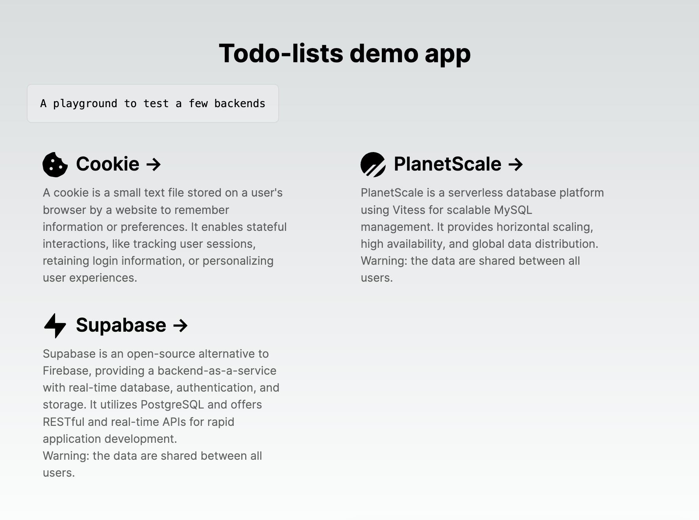
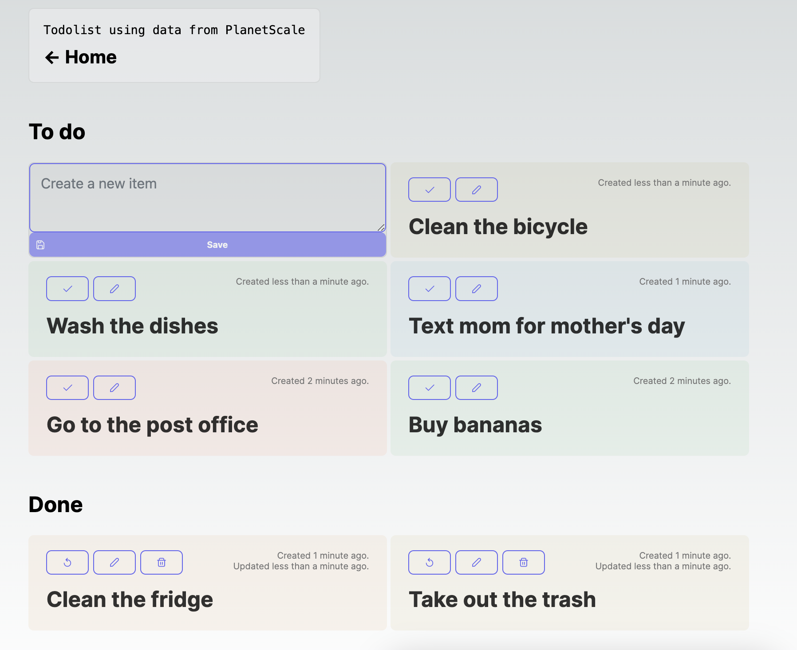
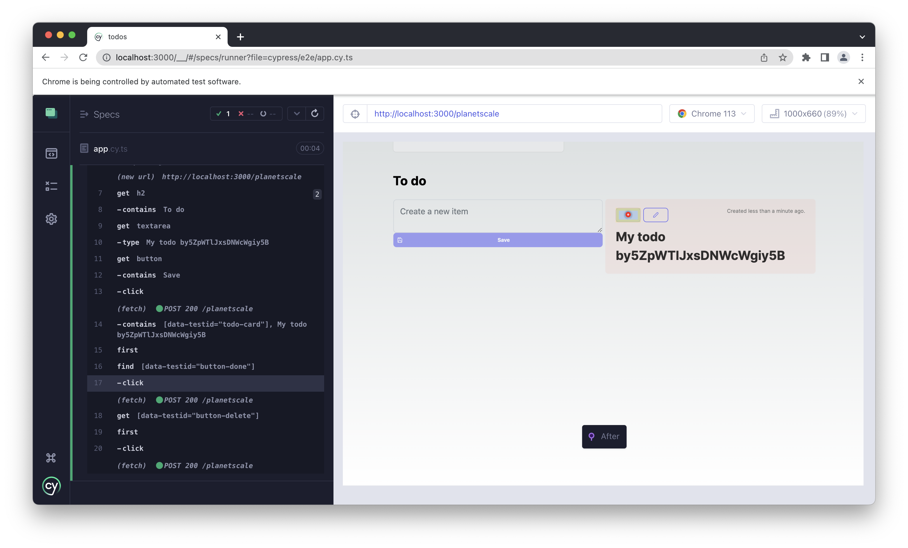

# Todo List

Small todo app meant to test Next 13 features, backend/data providers, UI components, etc...

## [todos-lzear.vercel.app](https://todos-lzear.vercel.app)

## Getting started locally

Run `yarn install`, then `yarn dev`.

You can set up backends with the following providers:

### PlanetScale + Prisma

1. Create a PlanetScale account
2. Create a `todos` database
3. Create a `dev` branch
4. Run `pscale-connect` and then in another terminal `pscale-db-push`
5. Ensure your `.env` has a connection string, for example:
    ```
    PLANETSCALE_DATABASE_URL = 'mysql://root@127.0.0.1:3309/todos
   ```

### Supabase

1. Create a Supabase account
2. Create a `todos` table
   ```sql
   create table
     public.todos (
       id text not null,
       created_at timestamp with time zone not null default now(),
       updated_at timestamp with time zone not null default now(),
       name text not null,
       done boolean not null,
       constraint todos_pkey primary key (id)
     ) tablespace pg_default;
   ```
3. Ensure your `.env` has:
    ```
    SUPABASE_URL = 'https://******.supabase.co'
    SUPABASE_KEY = 'eyJ*******'
   ```

## Test

* Unit tests: `yarn test`
* Cypress tests: `yarn e2e`

## Features / Todos

- [x] Integrate with PlanetScale
- [x] Integrate with Supabase
- [x] Use cookies as a data store
- [ ] Integrate with Fly.io
- [ ] Integrate with Railway
- [ ] Find a React component library that works well with Next 13
- [ ] Stop sharing the todos across users

## Screenshots

### Home screen:


### Todo list:


### Cypress tests:

